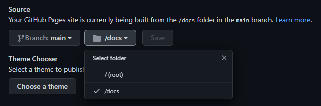

## GitHub Pages

&emsp;&emsp;GitHub Pages 本质上是一个静态网站托管系统，比较常用的是个人站点，也就是创建名为"\<username\>.github.io"的仓库作为一个静态网页入口。它有3种存在方式：

- 识别 main branch 根目录下的：README.md 或 index.html
- 识别 main branch /docs 目录下的：README.md 或 index.html
- 识别 gh-pages branch 根目录下的：README.md 或 index.html

&emsp;&emsp;因此我们可以在GitHub上创建一个名为\<username\>.github.io的public仓库，如果想方便的查看效果，可以勾选生成默认的readme.md，之后访问\<username\>.github.io即可看到效果。如果希望自定义网页内容，则可以不勾选生成readme.md，而将其克隆到本地：

```bash
git clone git@github.com:<username>/<username>.github.io.git
cd <username>.github.io
echo "Hello World" > index.html
```

&emsp;&emsp;之后推到GitHub，访问\<username\>.github.io即可看到效果。

```bash
git add --all
git commit -m "Initial commit"
git push -u origin main
```

参考：[GitHub官方教程](https://pages.github.com/)

## Hugo

官网连接： [Hugo_Quick-Start](https://gohugo.io/getting-started/quick-start/)

### 下载 Hugo

Github <https://github.com/gohugoio/hugo/releases>

&emsp;&emsp;Windows中无需安装，解压到喜欢的位置后将hugo.exe所在路径添加到环境变量中（可选）即可。
在git bash中敲入一下命令确认可以执行；不建议使用Powershell，因为后续使用echo等命令时会造成乱码。

```bash
hugo version
```

### 创建 Hugo 站点

```bash
hugo new site quickstart
```

&emsp;&emsp;找到一个你喜欢在本地存放代码的文件夹，执行这段代码，然后存放代码仓库的文件夹“quickstart”将会被创建，内部已经生成了Hugo所必须的一些代码。此时可以切换到代码仓库：

```bash
cd quickstart
```

&emsp;&emsp;之后可以使用git初始化代码仓库：

```bash
git init
```

### 站点配置

&emsp;&emsp;打开站点目录下的 config.toml (或 config.yml)，添加或修改如下配置信息：

```toml
```

```yaml
languageCode: zh-CN # CN大写?
publishdir: 'docs' # 发布文件夹，配合 github pages 将网页文件生成到docs文件夹中

defaultContentLanguage: "zh-cn" # 默认语言[en, zh-cn, fr, ...] 影响生成html的lang
hasCJKLanguage: true # 包含中日韩文等，使字数统计准确
isCJKLanguage: true

theme: "PaperMod" # 选择的主题的文件夹名
```

#### 代码行号

&emsp;&emsp;上述配置并不能将网页内代码行号显示出来，因此在[markup.highlight]下添加配置（具体参见[官方文档](https://gohugo.io/content-management/syntax-highlighting/)）：

```toml
linenos = true
```

&emsp;&emsp;其他未测试配置（来自<https://huangzhongde.cn/post/2020-02-22-hugo-code-linenumber/>）

```toml
pygmentsUseClasses = true
[markup]
  [markup.highlight]
    codeFences = true
    guessSyntax = true
    hl_Lines = ""
    lineNoStart = 1
    lineNos = true
    lineNumbersInTable = false
    noClasses = true
    style = "github"
    tabWidth = 4
```

&emsp;&emsp;防复制行号（未测试、可能使用的主题不需要配置）

```css
.highlight .ln {
    width: 20px;
    display: block;
    float: left;
    text-align: right;
    user-select: none; /* 复制是不能被选中，其他的是格式上的调整 */
    padding-right: 8px;
    color: #ccc;
}
```

&emsp;&emsp;其他配置详见 Hugo 主题配置文章

### 创建文章

```bash
hugo new <content内文件夹路径>/<文章文件名.md>
hugo new posts/my-first-post.md
```

&emsp;&emsp;以上命令在代码仓库中content\posts文件夹中创建文章草稿"my-first-post.md"。  
&emsp;&emsp;打开"my-first-post.md"，文件开头"---"之间已经存在预先生成的信息：

```md
---
title: "my-first-post"
date: 2021-10-21T20:09:21+08:00
draft: true
---
```

&emsp;&emsp;draft默认为true，此时不会被生成到网页中；编辑完成内容后将其修改为false以参与网页构建，或使用-D参数使草稿临时参与构建。

### 构建网页

&emsp;&emsp;在本地生成，-D表示构建草稿。使用浏览器访问<http://localhost:1313>进行预览。

```bash
hugo server -D
```

&emsp;&emsp;正式构建网页，默认构建在/public目录中。[输入hugo的生成方式只会往public文件夹里添加内容，但是不会删除外部已经不存在而public里面还存在的文件。所以我一般用hugo -F --cleanDestinationDir命令，表示每次生成的public都是全新的，会覆盖原来的。](https://www.sulvblog.cn/posts/blog/build_hugo/)

```bash
hugo
hugo -D
hugo -F --cleanDestinationDir -D
```

## 将 Hugo 与 GitHub 建立连接

&emsp;&emsp;Github Pages中静态文件的存放位置有以下三种：（仓库中settings）

- main 分支
- main 分支下docs目录
- gh-pages 分支(前提是这个分支存在)



为实现hugo静态页面的发布，可以在config.toml中添加以下配置：

```toml
publishdir = 'docs'
```

&emsp;&emsp;此后运行hugo命令将会使生成的网页文件保存在/docs目录下。将整个代码仓库推送到GitHub的main分支上，并在settings中设置站点source为main /docs。访问`https://<username>.github.io`即可看到成果。  
&emsp;&emsp;使用main分支的docs文件夹的好处是推一次代码就可以将源文档和构建的页面一起发布到GitHub中；如果希望对源文档和构建页面分别进行版本管理，则可以单独新建分支gh-pages（未测试）：参考<https://zhuanlan.zhihu.com/p/37752930>  
&emsp;&emsp;无需修改hugo的publishdir，直接将/public子目录添加到.gitignore文件中，使main分支忽略其更新；之后新建分支gh-pages。

```bash
# 忽略public子目录
echo "public" >> .gitignore
# 初始化gh-pages branch
git checkout --orphan gh-pages
git reset --hard
git commit --allow-empty -m "Initializing gh-pages branch"
git push origin gh-pages
git checkout master
```

&emsp;&emsp;为了提高每次发布的效率，可以将下述命令存在脚本中，每次只需要运行该脚本即可将gh-pages branch中的文章发布到Github的repo中：

```bash
#!/bin/sh

if [[ $(git status -s) ]]
then
    echo "The working directory is dirty. Please commit any pending changes."
    exit 1;
fi

echo "Deleting old publication"
rm -rf public
mkdir public
rm -rf .git/worktrees/public/

echo "Checking out gh-pages branch into public"
git worktree add -B gh-pages public origin/gh-pages

echo "Removing existing files"
rm -rf public/*

echo "Generating site"
hugo

echo "Updating gh-pages branch"
cd public && git add --all && git commit -m "Publishing to gh-pages (publish.sh)"

echo "Push to origin"
git push origin gh-pages
```

&emsp;&emsp;最后将main分支中的源文档和gh-pages分支h中的网页文档分别push到Github仓库中，进入settings将source选定gh-pages即可。

## 部署到 Github Pages 后无法正常显示样式

&emsp;&emsp;有些时候，hugo在本地预览没有问题，但当部署到github pages后样式无法正常显示，浏览器console报错：*Failed to find a valid digest in the 'integrity' attribute for resource...The resource has been blocked*。这是由于在Windows下拉取的仓库默认会被git转换成CRLF换行符，而推到github上时代码被转换成了LF；这就导致了hugo生成代码时计算的校验和和推送后的代码校验和不一致，因此浏览器无法加载。

&emsp;&emsp;可以禁止Windows下的git在拉取代码时的自动转换行为，以解决该问题：

```bash
git config --global core.autocrlf input # 提交时转换为LF，拉取时不转换
```

&emsp;&emsp;此外，还可以通过使用.gitattributes文件对换行符进行说明，让git对于css文件强制以crlf签出：

```text
*.css text eol=crlf
```

Reference:  
<https://github.com/lxndrblz/anatole/issues/114#issuecomment-1079609969>  
<https://github.com/adityatelange/hugo-PaperMod/issues/89>
