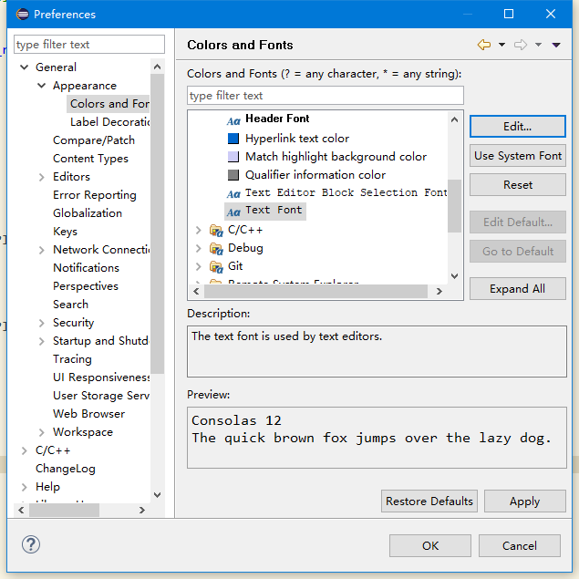
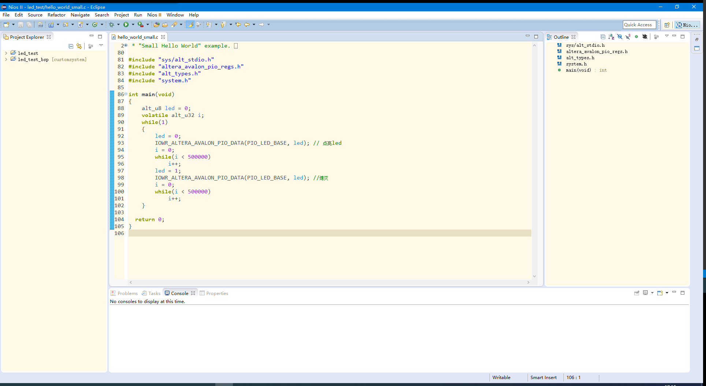

&emsp;&emsp;基于Eclipse定制的Nios II应用程序没有集成marketplace，因此无法在线安装插件，同时手动复制[离线插件](http://eclipse-color-theme.github.com/update)到程序目录下的plugins文件夹（参考：<https://blog.csdn.net/zbctop/article/details/90741420>）会导致程序崩溃从而无法启动，因此将采用手动下载.epf文件的方式，使用Import-Preference实现配色的修改。

Eclipse在线主题网站：<http://www.eclipsecolorthemes.org/>

## 修改代码字体和字号

&emsp;&emsp;依次点击：window--> preference-->General--> Appearence--> Colors and Fonts--> Basic--> Text Font,点击Edit选择喜欢的字体和大小，最后点击OK。



## 常用颜色修改位置

### 光标处相同代码高亮

Window -> preferences -> General -> Editors -> Text Editors -> Annotations:

- C/C++ Occurrences       相同位置高亮颜色
- C/C++ Write Occurrences 赋值语句高亮颜色

### 特定语法高亮

Window -> preferences -> C/C++ -> Editors -> Syntax Coloring -> (Elements):

- Preprocessor -> Directives 宏定义#include #define等
- Preprocessor -> Headers    头文件 "main.h"等
- Code -> Typedefs           通过typedef关键字定义的内容 uint等
- Code -> Macro definitions  宏定义内容 #define后的内容 PI等
- Code -> Macro references   宏定义的引用 代码中出现的部分PI等

## 修改左右侧资源管理器背景颜色

&emsp;&emsp;找到<安装目录>\plugins\org.eclipse.platform_x.x.x.vxxxxxxxx-xxxx\css文件夹，用文本编辑器打开e4_default_win7.css（对应Theme中的Windows选项），在文件末尾添加如下内容：

```css
#org-eclipse-jdt-ui-PackageExplorer Tree,
#org-eclipse-ui-navigator-ProjectExplorer Tree,
#org-eclipse-ui-views-ContentOutline Tree,
#PerspectiveSwitcher ToolBar {
    font-family: courier new; /* default window font */
    font-size: 10px; /* default window font size*/
    background-color: #FFFAE8;
}
```

保存后重启Eclipse即可看到效果。



&emsp;&emsp;此时console背景仍为默认的白色，因此可以修改在window--> preference--> **Run/Debug**--> Console下修改Background color。

## 配色方案导出

参考：[CSDN[秋之菌]：eclipse配置文件导出问题](https://blog.csdn.net/huanghui167/article/details/8115847)

&emsp;&emsp;修改Eclipse的如字体、背景、快捷键及一些template等之后，新建工作空间时eclipse仍会使用默认配置因此可以将相关配置导出后导入新的工作空间。

- 使用eclipse的导出功能（不推荐，很多配置不能导出）:工作目录中右键选择Export->General->Preference，这样可以导出epf文件，新的工作空间中可以用Import导入该配置文件，这个方法的确可以导入绝大多数的配置，但是并不全，导入后会丢失很多配置。
- 方法二：将\<workspace>/.metadata/.plugins/org.eclipse.core.runtime中的.settings文件夹拷贝出来，里面就是所有的配置文件，新建工作空间的时候将该.settings文件夹替换掉新工作空间中的.settings文件夹即可。（有网友是将.plugings文件夹替换，但是.plugings文件夹太大了，实际上就是替换.settings文件夹，.settings只有几百k。）

&emsp;&emsp;另外若需要导出界面上的工具栏对话框布局等：将该文件夹\<workspace>/.metadata\.plugins\org.eclipse.e4.workbench 保存起来即可。（eclipse有不少工具，我们安排好在界面上要使用的常用工具，不希望每个工作空间都要重新将这些工具重新弄出来排版好）
