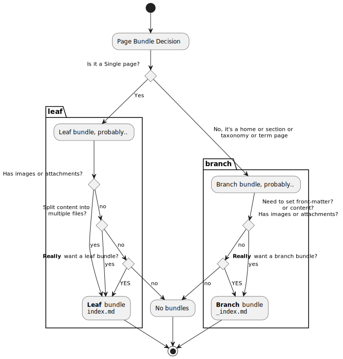

## Hugo 目录结构

```txt
.(hugo-root)
|-- archetypes/ (内容模板文件)
|-- assets/     (not created by default)
|   |-- css/    (adding custom css to replace css in themes)
|   |   |-- *.*
|   |   `-- *.*
|   `-- ***/
|-- content/    (存放文章内容，通过"hugo new"创建的文件以此为根目录)
|   `-- posts/
|       `-- *.md
|-- data/       (存储网站用到一些配置、数据文件。文件类型可以是yaml|toml|json等格式，生成网站时使用)
|-- docs/       (github pages可以选用docs作为网站根目录，添加publishdir: 'docs'将网站生成在该目录下)
|-- layouts/    (渲染文章内容的模板文件，相较于themes/<theme-name>/layouts目录下的同名文件具有更高优先级)
|-- resources/
|-- static/     (存储图片、css、js等静态资源文件；md中引用图片的根目录位于此文件夹下)
|-- themes/     (存储不同主题，可以方便的切换网站的风格样式)
`-- config.yml  (或config.toml，config.json，网站默认配置文件)
```

*tree --dirsfirst --charset=ascii /path/to/directory将生成一个很好的ASCII树，可以将其整合到文档中：*

```txt
(example fire tree)
|   |-- de-DE
|   |   |-- art.mshc
|   |   |-- artnoloc.mshc
|   |   |-- clientserver.mshc
|   |   |-- noarm.mshc
|   |   |-- resources.mshc
|   |   `-- windowsclient.mshc
|   `-- en-US
|       |-- art.mshc
|       |-- artnoloc.mshc
|       |-- clientserver.mshc
|       |-- noarm.mshc
|       |-- resources.mshc
|       `-- windowsclient.mshc
`-- IndexStore
    |-- de-DE
    |   |-- art.mshi
    |   |-- artnoloc.mshi
    |   |-- clientserver.mshi
    |   |-- noarm.mshi
    |   |-- resources.mshi
    |   `-- windowsclient.mshi
    `-- en-US
        |-- art.mshi
        |-- artnoloc.mshi
        |-- clientserver.mshi
        |-- noarm.mshi
        |-- resources.mshi
        `-- windowsclient.mshi
```

## 配置文件分离设计

&emsp;&emsp;*...待更新...*

## 静态资源（图片等）存放方式

参考：  
&emsp;&emsp;[Hugo官方文档-Oorganization](https://gohugo.io/content-management/organization/)  
&emsp;&emsp;[Hugo官方文档-Page Bundles](https://gohugo.io/content-management/page-bundles/)

&emsp;&emsp;选择合适的内容组织方式：（参考：[Hugo: Leaf and Branch Bundles](https://scripter.co/hugo-leaf-and-branch-bundles/)）



*...待更新...*

## 配置生成leaf bundles类型文章的模板

参考：  
&emsp;&emsp;[Hugo官方文档-Archetypes](https://gohugo.io/content-management/archetypes/#directory-based-archetypes)  
&emsp;&emsp;[stackoverflow：adding a page bundle with `hugo new`](https://stackoverflow.com/questions/69675565/adding-a-page-bundle-with-hugo-new)

&emsp;&emsp;在archetypes文件夹内创建如下文件结构：

```txt
.(archetypes)
|-- post-bundle/   <-- (create)
|   |-- images/    <-- (an empty dir will be generated)
|   `-- index.md   <-- (write archetype in, similar as default.md)
`-- default.md
```

其中，post-bundle文件夹下的内容将作为模板在创建文章时自动生成；在index.md文件中写入以下内容：

```md
---
title: {{ replace .Name "-" " " | title }}
date: {{ .Date }}
lastmod: {{ .Date }}
tags: 
- default
categories: 
- default
draft: true
---


```

&emsp;&emsp;执行以下命令，将会在posts文件夹下生成名为"post(dir)name"的文件夹，并在其中自动创建index.md和images空文件夹（与archetypes文件夹下的post-bundle具有相同结构）。

```bash
hugo new --kind post-bundle posts/<post(dir)name>
```
