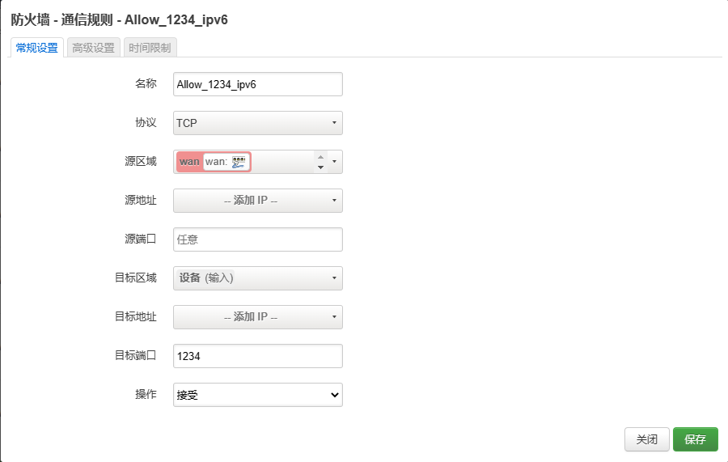
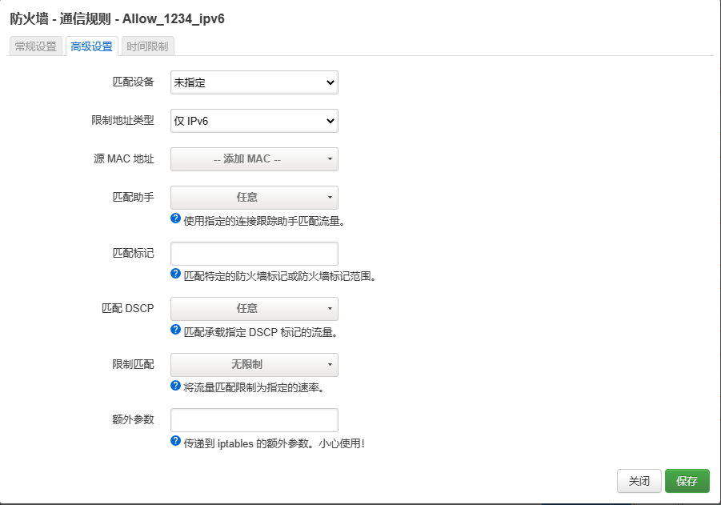

## 安装 sftp

&emsp;&emsp;如果 OpenWrt 不支持使用 Xftp 等软件进行传输文件时，需要手动安装 *openssh-sftp-server*。[^sftp_1] [^sftp_2]

```bash
opkg update
opkg install openssh-sftp-server
/etc/init.d/vsftpd enable
/etc/init.d/vsftpd start
```

## 启用 SSL

&emsp;&emsp;OpenWrt 使用 uhttpd 作为web服务器，配置文件为 /etc/config/**uhttpd**；可以使用vi修改其配置，并上传ssl证书到配置的路径下。  
&emsp;&emsp;此外，uhttpd 默认禁止通过外网访问路由器界面，如果要取消限制同样需要修改配置文件*option rfc1918_filter '0'*。

```conf
config uhttpd 'main'
    # ...
    list listen_https '0.0.0.0:443'
    list listen_https '[::]:443'
    option rfc1918_filter '0'                       # disable rfc1918 filter
    option redirect_https '1'                       # redirect http to https
    option cert '/etc/ssl/<domain>/<fullchain>.crt' # crt file
    option key '/etc/ssl/<domain>/<privkey>.key'    # key file
```

&emsp;&emsp;重启 uhttpd 服务：

```bash
/etc/init.d/uhttpd restart
```

## web 登录页面不显示用户名

&emsp;&emsp;OpenWrt 默认的登录页面会显示默认的用户名 root，如果更改了用户名或者为了安全考虑不想把他显示出来可以修改一下 luci 的 html 文件 */usr/lib/lua/luci/view/**sysauth.htm***

```diff
<!-- ... -->

<div class="cbi-value-field">
-    <input class="cbi-input-user" type="text" name="luci_username" value="<%=duser%>" />
+    <input class="cbi-input-user" type="text" name="luci_username" value="" />
</div>

<!-- ... -->

<script type="text/javascript">//<![CDATA[
-var input = document.getElementsByName('luci_password')[0];
+var input = document.getElementsByName('luci_username')[0];
if (input)
    input.focus();
//]]></script>

<!-- ... -->
```

```html

```

## ipv6 to ipv4 端口转发

&emsp;&emsp;虽然 ipv6 时代每个设备都可以获得独立的公网 ipv6 地址，但是要直接解析到设备的 ip 需要对每个设备分别做 ddns ；且由于每个设备获取到的 ipv6 地址个数很多，机制也很复杂，我还没研究明白，所以直接只对路由器的ipv6做ddns再通过端口转发到局域网的设备是个比较容易的解决方案。

&emsp;&emsp;OpenWrt 下使用 socat 可以实现从公网 ipv6 到 内网 ipv4 的转发。

```bash
opkg update
opkg install socat
```

### 编写配置文件

&emsp;&emsp;配置文件为 /etc/config/**socat**。例如下列的配置分别将 ipv6 的端口 ***1234*** 、***5678*** 转发到 192.168.1.***100***:***9012*** 和 192.168.1.***200***:***1314***。[^socat_1]

```code
config socat '1234'
    option enable '1'
    option SocatOptions '-d -d TCP6-LISTEN:1234,fork TCP4:192.168.1.100:9012'

config socat '5678'
    option enable '1'
    option SocatOptions '-d -d TCP6-LISTEN:5678,fork TCP4:92.168.1.200:1314'
```

&emsp;&emsp;应该也可以使用命令行添加，没试过。

```bash
uci set socat.1234='socat'
uci set socat.1234.enabled='1'
uci set socat.1234.SocatOptions='-d -d TCP6-LISTEN:1234,fork TCP4:192.168.1.100:9012'
uci commit socat
```

&emsp;&emsp;启动 socat 服务：

```bash
/etc/init.d/socat enabled
/etc/init.d/socat start
```

### 防火墙放行对应端口

&emsp;&emsp;打开 OpenWrt -> 网络 -> 防火墙 -> 通信规则，按照如下设置：

  


其中，目标区域应选择*设备（输入）*，目标端口输入上面配置的需要被转发的 ipv6 端口，高级设置中*限制地址类型*选择*仅IPv6*（IPv4的端口转发在防火墙的端口转发下设置）。设置完成后，如下图所示。


## DDNS 自启动

&emsp;&emsp;如果遇到 ddns 在系统启动或网络中断后进程没有启动，可以创建如下脚本进行定时检测：[^ddns_1]

### 编写进程监控脚本

&emsp;&emsp;在任意位置放置脚本文件 ddns_monitor.sh，并配置权限 0755 或 0777

```bash
logger "DDNS Checking Start !"
num=`ps | grep dynamic_dns_updater | grep -v grep | grep -v check | wc -l`  # 计算进程数
if [ $num -lt 2 ]                                              # 判断进程是否存在，根据创建的ddns个数修改
then
/etc/init.d/ddns restart
#echo "------------ddns start------------"               
logger "ddns start"               
fi
#printf "------------------------DDNS Checking Over  !---------------------------\n"
```

```bash
chmod 777 ddns_monitor.sh
```

### 创建定时任务

&emsp;&emsp;在 OpenWrt 中的*系统 -> 计划任务*中添加一行，实现每隔15分钟检查以下ddns进程还在不在

```code
*/15 * * * * sh <path>/ddns_monitor.sh
```

## References

[^sftp_1]:[Openwrt SSH服务端支持Sftp | Daniel Sun's Blog](https://onlyke.com/html/605.html)  
[^sftp_2]:[OpenWrt开启sftp，方便传输文件 | CSDN | bytxl](https://blog.csdn.net/bytxl/article/details/42146151)  
[^socat_1]:[openwrt ipv6如何端口转发？| 恩山无线论坛 | 99010](https://www.right.com.cn/forum/forum.php?mod=redirect&goto=findpost&ptid=4129434&pid=11351439)  
[^ddns_1]:[解决”动态DNS“开机不会自动更新和启动进程功能的失效问题 | 恩山无线论坛 | 野马joe](https://www.right.com.cn/forum/thread-182153-1-1.html)
