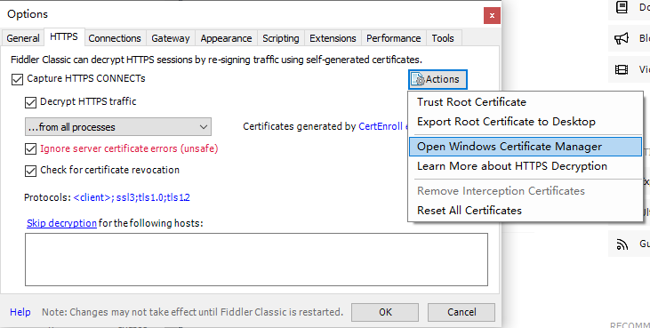
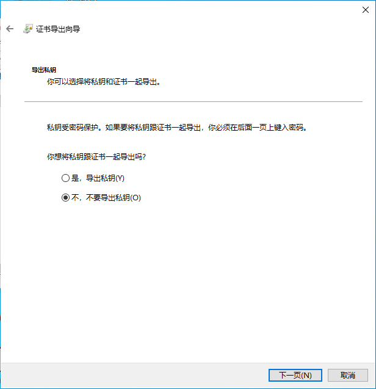
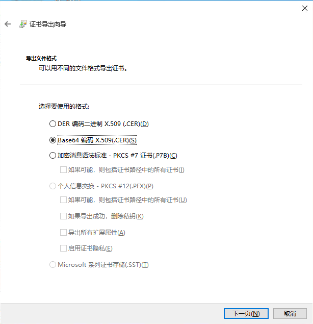

&emsp;&emsp;开启 Fiddler 抓包时，python 中的 requests.get()、requests.post() 数据包无法捕获，且在请求 https 时会产生 ssl.SSLError: [SSL: WRONG_VERSION_NUMBER] wrong version number (_ssl.c:1091) 错误。因此对于其请求应当做一定的修改。

## Fiddler 证书导出

&emsp;&emsp;打开 Fiddler，依次选择 Tools-Options...-HTTPS，点击右侧 Actions 中的 Open Windows Certificate Manager。



&emsp;&emsp;展开个人-证书，在右侧找到证书“DO_NOT_TRUST_FiddlerRoot”，右键-所有任务-导出。不导出私钥、选择编码方式为 Base64 X.509，得到 .cer 格式的文件。






## requests 参数设置

&emsp;&emsp;将得到的 .cer 文件后缀改为 .crt，放到项目文件夹下，在 requests 请求前添加如下配置并添加请求参数即可。

```py
proxies = {'http':'http://127.0.0.1:8888','https':'https://127.0.0.1:8888'}
certFile = '.\fiddlerCert.crt')
r = requests.get("https://exampleurl.example.com", proxies=proxies, verify=certFile)
```

&emsp;&emsp;此后即可用 Fiddler 对 requests 请求于响应进行抓包。

&emsp;&emsp;此外有人说对 requests 和 certifi 版本有要求，可以参考一下。

```bash
pip install requests==2.19.1
pip install certifi==2018.8.13
```
