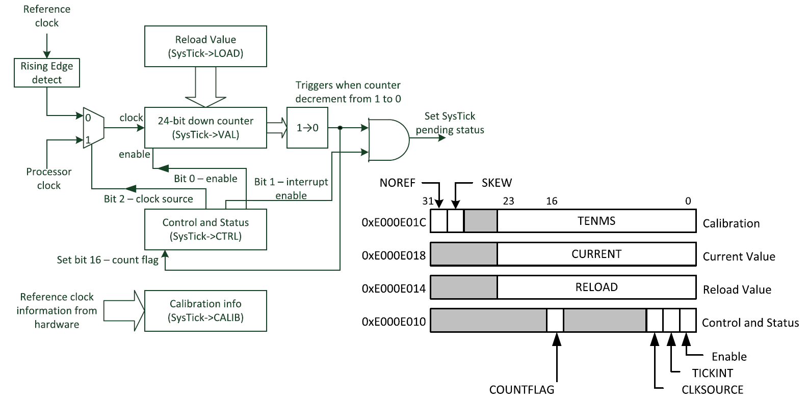
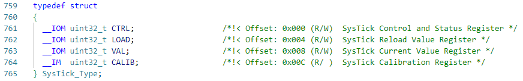
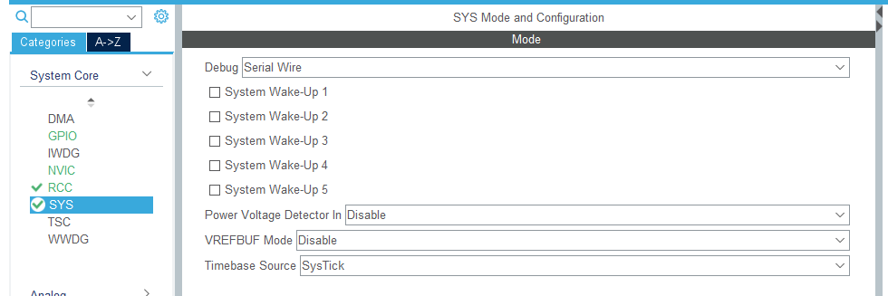
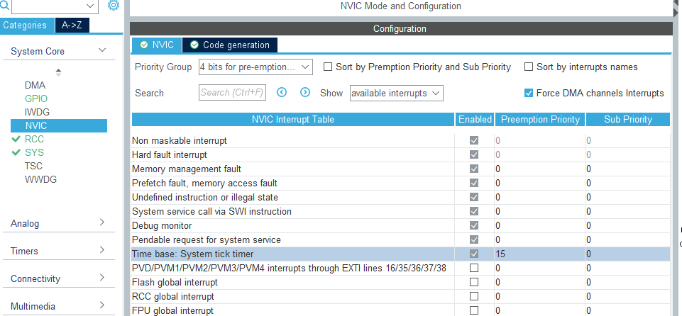
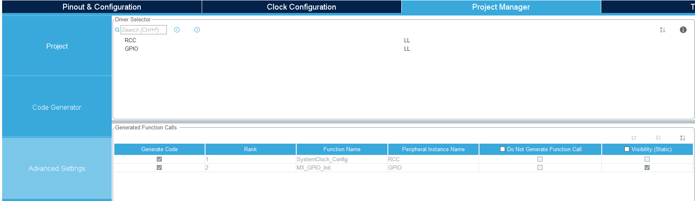
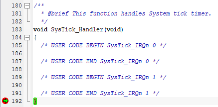

## SysTick 介绍

&emsp;&emsp;Cortex-M处理器内集成了一个小型的名为SysTick的定时器，它属于NVIC的一部分；SysTick为简单的24位向下计数器，在使用操作系统时通常用作周期性中断来定期触发OS内核，用于处理任务管理和上下文切换等；当不使用操作系统时，SysTick可以当作简单定时器外设来使用（《ARM Cortex-M3与Cortex-M4权威指南（第3版）》，p215）。下图为SysTick定时器的简单框图：[^ArmCortexM3_1] [^systick_1]  


&emsp;&emsp;SysTick定时器中存在4个寄存器，CMSIS-Core头文件中定义了一个名为SysTick的结构体，例如在STM32L4的库函数中core_cm4.h定义了如下结构体  


## CubeMX 配置

1. 点击 SYS，将 Timebase Source 选择为 SysTick（项目默认为 SysTick）


1. 点击NVIC，配置Time base的中断优先级


1. 在Project Manager-->Advanced Setting中选择LL库


1. 点击Generate Code生成代码

## 代码编写与测试

&emsp;&emsp;在main()函数中调用的函数SystemClock_Config()中对SysTick进行初始化：

```c {hl_lines=[6]}
...
LL_RCC_SetAHBPrescaler(LL_RCC_SYSCLK_DIV_1);
LL_RCC_SetAPB1Prescaler(LL_RCC_APB1_DIV_1);
LL_RCC_SetAPB2Prescaler(LL_RCC_APB2_DIV_1);

LL_Init1msTick(80000000);

LL_SetSystemCoreClock(80000000);
...
```

其默认提供1ms的时基：

```c
void LL_Init1msTick(uint32_t HCLKFrequency)
{
  /* Use frequency provided in argument */
  LL_InitTick(HCLKFrequency, 1000U);
}
```

&emsp;&emsp;但LL库的初始化过程默认并不会开启SysTick->VAL向下计数器溢出中断[^systick_3]（SysTick_Handler）：

```c  {hl_lines=["14-15"]}
/**
  * @brief  This function configures the Cortex-M SysTick source of the time base.
  * @param  HCLKFrequency HCLK frequency in Hz (can be calculated thanks to RCC helper macro)
  * @note   When a RTOS is used, it is recommended to avoid changing the SysTick
  *         configuration by calling this function, for a delay use rather osDelay RTOS service.
  * @param  Ticks Number of ticks
  * @retval None
  */
__STATIC_INLINE void LL_InitTick(uint32_t HCLKFrequency, uint32_t Ticks)
{
  /* Configure the SysTick to have interrupt in 1ms time base */
  SysTick->LOAD  = (uint32_t)((HCLKFrequency / Ticks) - 1UL);  /* set reload register */
  SysTick->VAL   = 0UL;                                       /* Load the SysTick Counter Value */
  SysTick->CTRL  = SysTick_CTRL_CLKSOURCE_Msk |
                   SysTick_CTRL_ENABLE_Msk;                   /* Enable the Systick Timer */
}
```

所以若要在中断函数SysTick_Handler()中进行程序处理，需要手动在main()函数内初始化代码后添加相关代码：[^systick_2]

```c {hl_lines=[2]}
/* USER CODE BEGIN SysInit */
LL_SYSTICK_EnableIT();
/* USER CODE END SysInit */
```

之后便可在计数器减至0时进入中断函数：  


## 微秒级精确延时

&emsp;&emsp;未验证，仅思路展示，需要重写考虑恢复原有延时

```c
void Delay_us(uint32_t n) //延时多少微秒，n 就输入多少
{
    SysTick->LOAD = 72 * n;                   //装载计数值，因为时钟 72M，72 次在 1μs
    SysTick->CTRL = 0x00000005;               //时钟来源设为为 HCLK(72M)，打开定时器
    while((SysTick->CTRL & 0x00010000) != 0); //等待计数到 0
    SysTick->CTRL = 0x00000004;               //关闭定时器
}
```

## 其他问题（未验证）

&emsp;&emsp;时钟源设置[^systick_4]  
&emsp;&emsp;[生成代码中默认是以 HCLK 时钟 为 SysTick 时钟源](https://blog.csdn.net/Brendon_Tan/article/details/108102254)

## References

[^ArmCortexM3_1]:[《ARM Cortex-M3与Cortex-M4权威指南（第3版）》 | ISBN：9787302402923](http://www.tup.tsinghua.edu.cn/booksCenter/book_05443401.html)  
[^systick_1]:[STM32 的系统滴答定时器( Systick) 彻底研究解读 | cnblogs | 王健](https://www.cnblogs.com/nevel/p/6357349.html)  
[^systick_2]:[LL_Init1msTick disables SysTick interrupt | ST community | Bogdan Golab](https://st.force.com/community/s/question/0D50X00009XkfuLSAR/llinit1mstick-disables-systick-interrupt)  
[^systick_3]:[STM32CubeMX 实战教程：SysTick 实验（LL 库） | CSDN | Brendon_Tan](https://blog.csdn.net/Brendon_Tan/article/details/108102254)  
[^systick_4]:[【经验分享】填坑-关于SysTick定时器 | ST中文论坛 | STMCU小助手](https://shequ.stmicroelectronics.cn/thread-631424-1-1.html)
