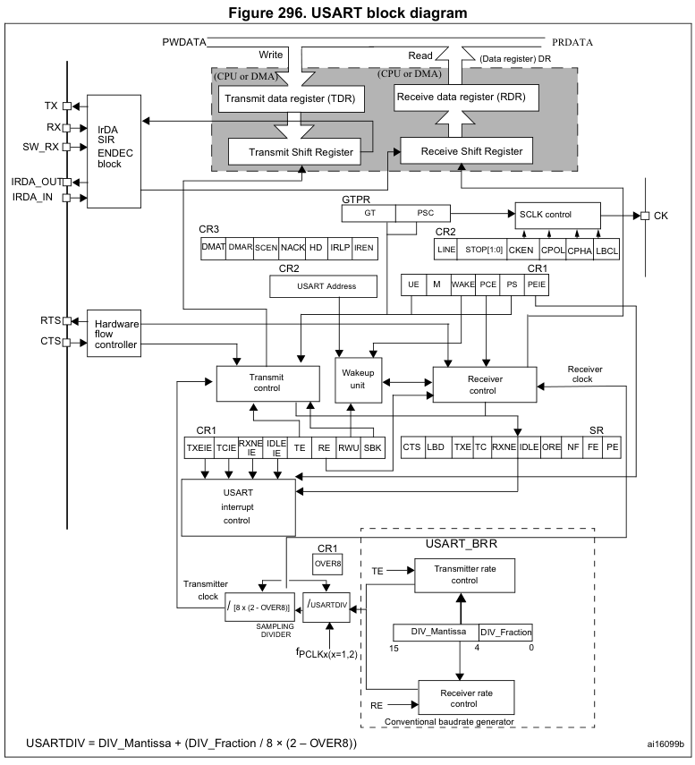
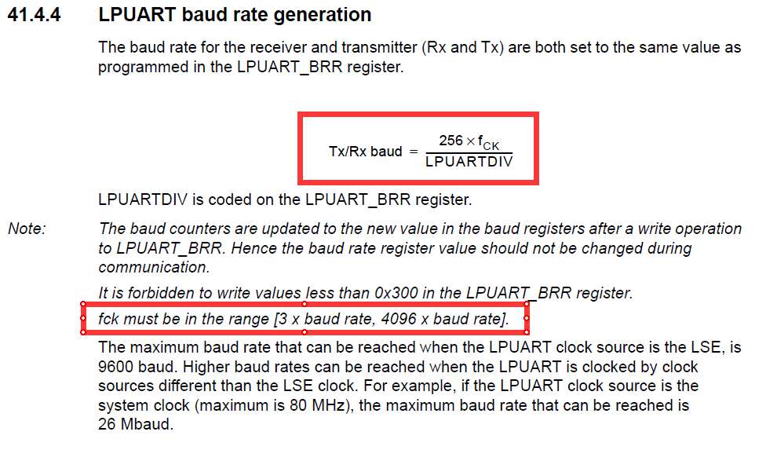
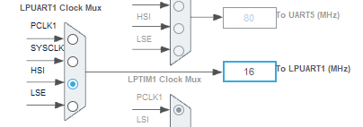
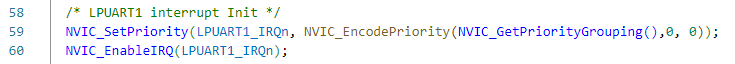
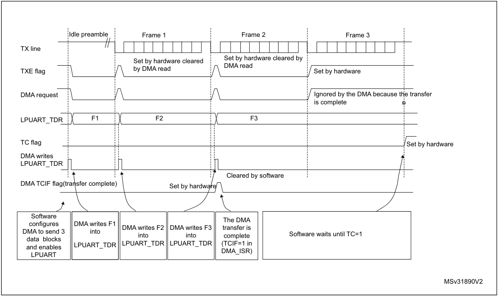
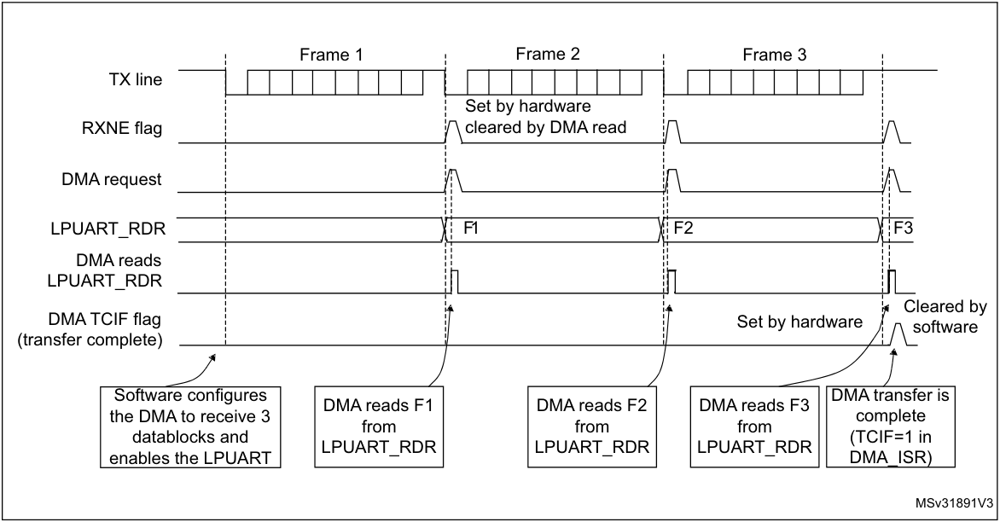
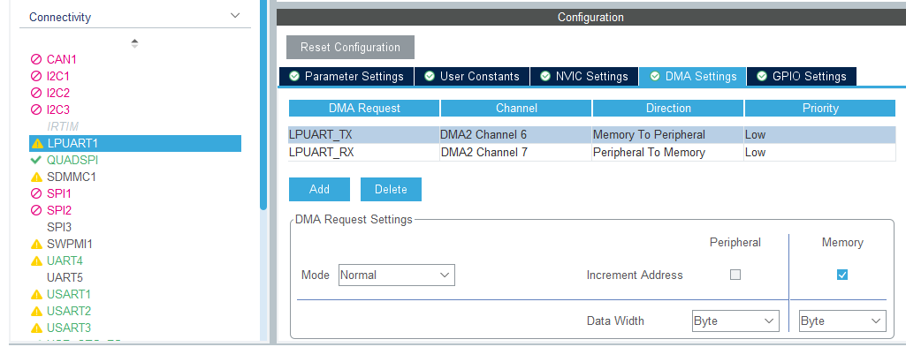
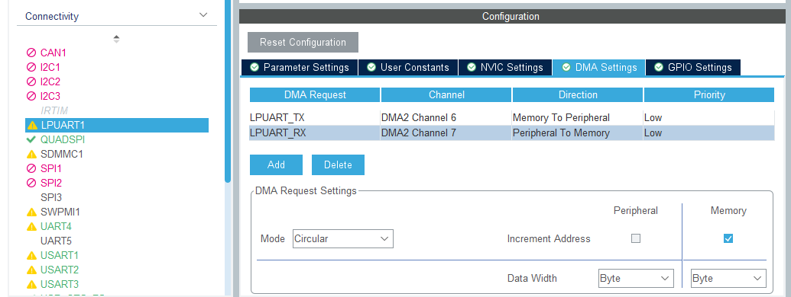
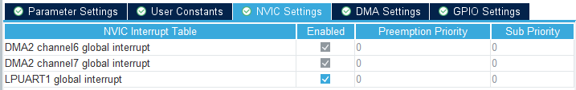
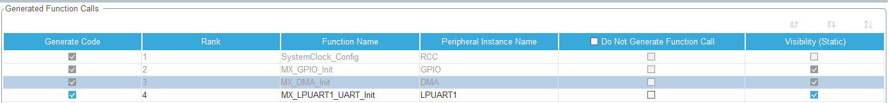

## UART 框图

&emsp;&emsp;查看芯片对应的 Reference Manual 的 USART/UART 章节可以找到其框图。以 F4 系列的参考手册为例，其框图如下[^usart_block_diagram]：



&emsp;&emsp;可以看出，对于发送的数据，依次经过 **TDR 寄存器 -> 发送移位寄存器 -> TX 端口**；对于接收的数据，从 **RX** 端口依次经过 **接收移位寄存器 -> RDR寄存器**。

## UART 寄存器

- **RXNE**(Read data register not empty)：当接收移位寄存器中的**数据被传送到 RDR 寄存器**时，该位被置1；若打开串口接收中断(RXNEIE)=1时，会产生中断。**读取 RDR 寄存器**该位自动清零。
- **TXE**(Transmit data register empty)：当**TDR 寄存器中的数据被传送到发送移位寄存器**时（此时可以向 TDR 寄存器写入新数据发送），该位被置1；若打开串口发送中断(TXEIE=1)时，会产生中断。当**向 TDR 寄存器中写入新数据**时该位自动清零。
- **TC**(Transmission complete)：当**移位寄存器的数据发送完成且 TDR 寄存器为空（没有下一个要发送的数据了）**时，该位被置1；若打开发送完成中断(TCIE=1)时，会产生中断。当**向 TDR 寄存器中写入新数据**时该位自动清零，也可以手动清零。
- **IDLE**(Idle line detected)：空闲位针对**接收**过程；当串口接收到一个字节后的**一个周期**内都没有检测到起始位时（即检测到 **Idle frame** ）， IDLE 被置1[^RM0351_usart_character_description] [^RM0351_usart_receiver]。当 IDLE 被置1后，只有再次接收到数据后（ RXNE 置1）才会检测下一次空闲。

## 低功耗串口的时钟和波特率

&emsp;&emsp;对于LPUART，其波特率和其时钟源有需要满足一定关系[^lpuart_baudrate_1]：



即LPUART的时钟源频率必须在3倍波特率到4096倍波特率之间。

&emsp;&emsp;对于CubeMX生成的工程，LPUART的时钟源默认为PCLK1（80M，STM32L4），因此其可以提供的最低频率为 80 * 10^6 / 4096 = 19532 bps。若要使用9600bps等低的波特率则应该首先修改 Clock Configuration 中的 LPUART 的时钟源为 HSI(16M)：



&emsp;&emsp;此时，允许的波特率范围为3907bps~5.33Mbps。

## 中断方式

### CubeMX 配置

&emsp;&emsp;选中需要的 UART，Mode 选择 Asynchronous，即异步通信方式；NVIC Settings 中勾选 global interrupt 并设置优先级。选择好对应的 GPIO 引脚后就可以生成工程了。

### 代码

> 参考 ST 固件库例程 *USART_Communication_Rx_IT[^stlib_example_ll_uart_rxit]*、*USART_Communication_Tx_IT[^stlib_example_ll_uart_txit]*。

#### 定义结构体 UartITModel

```c
typedef struct
{
    volatile uint8_t rxFlag;  // 接收完一帧数据标志位
    uint8_t rxLen;            // 当前数据帧长度
    uint8_t rxData[10];       // 当前数据
    uint8_t _rx_data_index;   // 下一个要接收的字节存放的数组下标

    volatile uint8_t txBusy;  // 0: 串口没有数据帧正在发送; 1: 有数据帧正在发送
    uint8_t txLen;            // 待发送的数据总长度
    uint8_t txData[10];       // 待发送的数据
    uint8_t _tx_data_index;   // 下一个要发送的字节的数组下标
} UartITModel_1010;
```

```c
UartITModel_1010 Lpuart1ITModel = {0};
```

```c
extern UartITModel_1010 Lpuart1ITModel;
```

#### 配置串口接收中断

&emsp;&emsp;生成的代码默认会使能串口中断，但并不会开启串口的发送或接收等中断：



&emsp;&emsp;添加并调用以下函数使能RXNE中断：

```c
void LPUART1_ITConfig(void);

void LPUART1_ITConfig(void)
{
    // if (LL_LPUART_IsActiveFlag_RXNE(LPUART1) == 1) // sometimes rxne is set after initialization
    // {
    //     LL_LPUART_ReceiveData8(LPUART1); // clear rxne
    // }
    LL_LPUART_EnableIT_RXNE(LPUART1); /* Enable RXNE interrupts */
}
```

#### 串口中断函数（RXNE）

```c
/**
  * @brief This function handles LPUART1 global interrupt.
  */
void LPUART1_IRQHandler(void)
{
    /* USER CODE BEGIN LPUART1_IRQn 0 */
    if ((LL_USART_IsEnabledIT_RXNE(LPUART1) == 1) && (LL_USART_IsActiveFlag_RXNE(LPUART1) == 1)) // 接收到数据
    {
        /* Read Received character. RXNE flag is cleared by reading of RDR register */
        uint8_t rxdata = LL_USART_ReceiveData8(LPUART1);
        Lpuart1ITModel.rxData[Lpuart1ITModel._rx_data_index++] = rxdata;
        // data condition or rx array full
        if ((rxdata == 0xFF) || (Lpuart1ITModel._rx_data_index == sizeof(Lpuart1ITModel.rxData)))
        {
            Lpuart1ITModel.rxLen = Lpuart1ITModel._rx_data_index;
            Lpuart1ITModel._rx_data_index = 0;
            Lpuart1ITModel.rxFlag = 1;
        }
    }
    /* USER CODE END LPUART1_IRQn 0 */
    /* USER CODE BEGIN LPUART1_IRQn 1 */

    /* USER CODE END LPUART1_IRQn 1 */
}
```

#### 发送数据

&ensp;&ensp;&ensp;&ensp;使用串口中断发送数据只需要开启 TXE 中断，在中断中依次将需要发送的数据写入 TDR 寄存器即可；写入最后一个字节后可以关闭 TXE 中断；但此时最后一个字节还没有被串口发送出去，需要开启 TC 中断以确保最后一字节数据被串口发送完成。

```c
void LPUART1_SendArrayIT(uint8_t *parr, uint8_t len);

void LPUART1_SendArrayIT(uint8_t *parr, uint8_t len)
{
    while (Lpuart1ITModel.txBusy == 1); // waiting last transmit
    Lpuart1ITModel.txBusy = 1;
    Lpuart1ITModel._tx_data_index = 0;
    Lpuart1ITModel.txLen = len;
    memcpy(Lpuart1ITModel.txData, parr, len);
    
    LL_LPUART_EnableIT_TXE(LPUART1); // enable tdr empty it
}
```

#### 串口中断函数（TX）

&emsp;&emsp;当 *收到 0xff 或接收缓冲区满* 时，产生数据帧接收完成标志：

```c
/**
  * @brief This function handles LPUART1 global interrupt.
  */
void LPUART1_IRQHandler(void)
{
    /* USER CODE BEGIN LPUART1_IRQn 0 */
    if ((LL_LPUART_IsEnabledIT_TXE(LPUART1) == 1) && (LL_LPUART_IsActiveFlag_TXE(LPUART1) == 1)) // TDR 发送寄存器空 可以放入数据发送 写DR寄存器即清空标志位
    {
        if (Lpuart1ITModel._tx_data_index == Lpuart1ITModel.txLen - 1)
        {
            LL_LPUART_DisableIT_TXE(LPUART1); // 关闭发送寄存器空中断
            LL_LPUART_EnableIT_TC(LPUART1);   // 使能发送完成中断
        }
        LL_LPUART_TransmitData8(LPUART1, Lpuart1ITModel.txData[Lpuart1ITModel._tx_data_index++]); // 写寄存器
    }
    if ((LL_LPUART_IsEnabledIT_TC(LPUART1) == 1) && (LL_LPUART_IsActiveFlag_TC(LPUART1) == 1))
    {
        LL_LPUART_ClearFlag_TC(LPUART1); /* Clear TC flag */
        Lpuart1ITModel.txBusy = 0;
    }
    /* USER CODE END LPUART1_IRQn 0 */
    /* USER CODE BEGIN LPUART1_IRQn 1 */

    /* USER CODE END LPUART1_IRQn 1 */
}
```

#### main

&emsp;&emsp;以回环应用为例，将串口接收缓冲区的数据发送出去：

```c
LPUART1_SendArrayIT(Lpuart1ITModel.rxData, Lpuart1ITModel.rxLen);
```

## DMA 方式

&emsp;&emsp;借助 DMA，可以使得串口进行连续通信。将串口寄存器的 DMAT 和 DMAR 位 置1可以使用 DMA 方式收发串口数据[^lpuart_dma]。对应的库函数为：

```c
void LL_LPUART_EnableDMAReq_TX(USART_TypeDef *LPUARTx); /* Enable DMA Mode for transmission */
void LL_LPUART_EnableDMAReq_RX(USART_TypeDef *LPUARTx); /* Enable DMA Mode for reception */
```

### DMA 寄存器

- **TCIFx**: channle x 传输完成
- **HTIFx**: channel x 传输一半
- **CNDTRx**: 需要传输的数据数量；只有 DMA 通道 disabled 时才可以写入数据；当对应通道被启用时，该寄存器变成只读，表示待传输数据的剩余个数。每次 DMA 传输后，该寄存器值递减；当 DMA 工作于 Normal 模式时，传输完成后该寄存器保持为 0；Circular 模式时，该寄存器在传输完成后自动重置为上次设置的值。

### 发送流程

&emsp;&emsp;使用 DMA 发送串口数据的过程：当串口的 TXE 被置1时，DMA 将数据从 SRAM 加载到 TDR 寄存器。其具体配置过程如下[^lpuart_dma]：

1. 配置 DMA 传输的**目的**地址为**TDR**寄存器地址（每次 TXE 置1时数据都会从存储区加载到 TDR 寄存器中）。
1. 配置 DMA 传输的**源**地址为**数据**地址（每次 TXE 置1时数据都会从该地址加载到 TDR 寄存器中）。
1. 配置 DMA 传输的总字节数（发送数据字节个数）。
1. 配置 DMA 通道的优先级。
1. 配置 DMA 传输完成/一半中断。
1. 清除串口寄存器的 TC 标志位。（如果使能 DMA 传输之前就使能了 TC 中断，则会立刻进入中断；若等到 DMA 传输完成后再使能 TC 中断，则可以不在这一步清除标志位。）
1. 激活 DMA 的对应通道。

&emsp;&emsp;当 DMA 传输的数据量到达设定的数据量时（数据被传送到 TDR 寄存器），产生中断 TCIF，但此时最后一个数据仍未被串口发送完成；若要禁止 UART 或进入停止模式前应监视串口的 TC 标志位以确保 UART 通信操作已经完成。



### 接收流程

&emsp;&emsp;使用 DMA 接收串口数据的过程：当串口的 RXNE 被置1时，DMA 将数据从 RDR 寄存器加载到 SRAM。其具体配置与发送过程类似[^lpuart_dma]。



### CubeMX 配置

&emsp;&emsp;DMA Settings 中添加 TX 和 RX；TX 的 Mode 选择 Normal，即发送一次自动停止，需要重新配置数据地址与长度；RX 的 Mode 选择 Circular，连续接收。





&emsp;&emsp;勾选 NVIC Settings 中的 global interrupt。



&emsp;&emsp;调整 Project Manager 中 Advanced Settings，移动初始化函数的调用顺序，确保 MX_DMA_Init 在 MX_xxx_UART_Init 之前，否则无法进入 DMA 传输过程[^cubemx_dmaseq]。



### 代码

> 参考：USART_Communication_TxRx_DMA[^stlib_example_ll_uart_txrxdma]、一个严谨的STM32串口DMA发送&接收（1.5Mbps波特率）机制[^uart_dma_example_1]、usart_rx_idle_line_irq_L4[^uart_dma_example_2]

#### 定长接收

&ensp;&ensp;&ensp;&ensp;若要在 DMA 不支持双缓冲的情况下实现数据双缓冲定长接收，可以结合 DMA 的 HT 中断实现，此时结构体中的 rxData （DMA 接收缓冲区）数组长度应为数据长度的一半，防止处理数据不及时一些数据被下一次 DMA 传输覆盖。

##### 定义结构体 UartDMAFixModel

```c
typedef struct
{
    volatile uint8_t rxFlag;   // 接收完一帧数据标志位 1: 接收完成
    uint8_t rxLen;             // 定长数据帧长度, _rx_dma_data 的一半
    uint8_t _rx_dma_data[20];  // DMA 接收数据缓冲区，定长接收每次只处理一半数据
    uint8_t *rxDataPointer;    // 指向当前可以处理的数据的首地址, 在 DMA 中断切换地址

    volatile uint8_t txBusy;   // 0: 串口没有数据帧正在发送; 1: 有数据帧正在发送
    uint8_t txData[10];        // 需要发送的数据，同时也是 DMA 发送的缓冲区
} UartDMAFixModel_1010;
```

```c
UartDMAFixModel_1010 Lpuart1DMAFixModel = 
{
    .rxFlag = 0,
    .rxLen = sizeof(Lpuart1DMAFixModel._rx_dma_data) / 2,
    ._rx_dma_data = {0},
    .rxDataPointer = NULL,

    .txBusy = 0,
    .txData = {0}
};
```

```c
extern UartDMAFixModel_1010 Lpuart1DMAFixModel;
```

##### 配置串口 DMA 地址、长度、中断

&emsp;&emsp;CubeMX 生成的代码并不会配置 DMA 的外设和存储器地址、数据长度以及相应的传输中断；编写并调用下列代码以设定串口 TX 和 RX 的 DMA 相应配置。

```c
/**
 * @brief extra config LPUART1 TX RX Variable length data reception use DMA
 * @param None
 * @retval None
 */
void LPUART1_DMAFixConfig(void)
{
    LL_DMA_SetPeriphAddress(DMA2, LL_DMA_CHANNEL_6, LL_LPUART_DMA_GetRegAddr(LPUART1, LL_LPUART_DMA_REG_DATA_TRANSMIT)); // tx dma dest address
    LL_DMA_EnableIT_TC(DMA2, LL_DMA_CHANNEL_6); // tx dma transfer complete interrupt

    // rx dma source address and dest address and length
    LL_DMA_SetPeriphAddress(DMA2, LL_DMA_CHANNEL_7, LL_LPUART_DMA_GetRegAddr(LPUART1, LL_LPUART_DMA_REG_DATA_RECEIVE));
    LL_DMA_SetMemoryAddress(DMA2, LL_DMA_CHANNEL_7, (uint32_t)Lpuart1DMAFixModel._rx_dma_data);
    LL_DMA_SetDataLength(DMA2, LL_DMA_CHANNEL_7, sizeof(Lpuart1DMAFixModel._rx_dma_data));

    LL_DMA_EnableIT_TC(DMA2, LL_DMA_CHANNEL_7); // rx dma transfer complete interrupt
    LL_DMA_EnableIT_HT(DMA2, LL_DMA_CHANNEL_7); // rx dma half transfer interrupt

    LL_DMA_EnableChannel(DMA2, LL_DMA_CHANNEL_7); // enable uart dma rx

    LL_LPUART_EnableDMAReq_TX(LPUART1); // enable dma to handle uart tdr
    LL_LPUART_EnableDMAReq_RX(LPUART1); // enable dma to handle uart rdr
}
```

##### DMA 中断函数（HT TC）

&ensp;&ensp;&ensp;&ensp;使用 DMA 的传输完成中断和传输半完成中断可以方便的进行串口数据的定长接收；根据不同的 DMA 标志位设定指向当前可以处理的数据的首地址。

```c
/**
 * @brief This function handles DMA2 channel7 global interrupt.
 */
void DMA2_Channel7_IRQHandler(void)
{
    /* USER CODE BEGIN DMA2_Channel7_IRQn 0 */
    // lpuart1 rx
    if (LL_DMA_IsEnabledIT_HT(DMA2, LL_DMA_CHANNEL_7) && LL_DMA_IsActiveFlag_HT7(DMA2))
    {
        LL_DMA_ClearFlag_HT7(DMA2);
        // TODO: uart rx dma half transfer
        Lpuart1DMAFixModel.rxDataPointer = Lpuart1DMAFixModel._rx_dma_data + 0;
        Lpuart1DMAFixModel.rxFlag = 1;
    }
    if (LL_DMA_IsEnabledIT_TC(DMA2, LL_DMA_CHANNEL_7) && LL_DMA_IsActiveFlag_TC7(DMA2))
    {
        LL_DMA_ClearFlag_TC7(DMA2);
        // TODO: uart rx dma transfer complete
        Lpuart1DMAFixModel.rxDataPointer = Lpuart1DMAFixModel._rx_dma_data + Lpuart1DMAFixModel.rxLen;
        Lpuart1DMAFixModel.rxFlag = 1;
    }
    /* USER CODE END DMA2_Channel7_IRQn 0 */

    /* USER CODE BEGIN DMA2_Channel7_IRQn 1 */

    /* USER CODE END DMA2_Channel7_IRQn 1 */
}
```

##### 重置 DMA 接收长度

&ensp;&ensp;&ensp;&ensp;对于定长数据的接收，数据接收完成是靠 DMA 的传输一半或传输完成标志位判断的；若某次通信时，数据帧的一个字节丢失，则会导致后续的数据全部错位，从而无法正确解析。因此在数据处理之前需要通过校验帧头或者校验和等方式判断数据是否有效；当前数据帧错误时，对于下一帧数据应重新从 DMA 数组的第一个元素开始接收。

&ensp;&ensp;&ensp;&ensp;下面假设数据帧头必须为 0x55，校验成功时，将收到的一帧数据通过串口发回；当数据帧校验失败时，关闭 DMA 接收通道并重置 DMA 接收数据长度，同时打开串口空闲中断，等待当前数据帧全部发送完成后重新打开 DMA 接收通道。

```c
/**
 * @brief Verify data frames and parse data
 * @param pdata pointer to the first data
 * @retval 1: verify success; 0: verify fail
 */
uint8_t Lpurat1DataProcess(uint8_t *pdata)
{
    uint8_t dataValid = 0;

    // Verify data frame
    if (pdata[0] != 0x55) // example: frame header must be 0x55
    {
        dataValid = 0;
    }
    else
    {
        dataValid = 1;
    }

    if (dataValid == 0)
    {
        // The data may be misaligned
        // reset dma rx length
        // 1st: disable dma rx channel
        LL_DMA_DisableChannel(DMA2, LL_DMA_CHANNEL_7);
        // 2nd: reset data length so that new transfer can be placed into the first array element
        LL_DMA_SetDataLength(DMA2, LL_DMA_CHANNEL_7, sizeof(Lpuart1DMAFixModel._rx_dma_data));
        // 3rd: enable uart rx idle it, When the current full data frame transmission is complete, re-enable DMA reception.
        LL_LPUART_EnableIT_IDLE(LPUART1);
        // 4th: (in the function UART IRQHandler)
        return 0;
    }

    // TODO: data parsing
    LPUART1_SendArrayDMA(pdata, Lpuart1DMAFixModel.rxLen);
    // ...

    return 1;
}
```

&ensp;&ensp;&ensp;&ensp;串口空闲中断处理过程：清除空闲标志位、关闭串口空闲中断、重新开启 DMA 接收通道。

```c
/**
 * @brief This function handles LPUART1 global interrupt.
 */
void LPUART1_IRQHandler(void)
{
    /* USER CODE BEGIN LPUART1_IRQn 0 */
    if ((LL_LPUART_IsEnabledIT_IDLE(LPUART1) == 1) && (LL_LPUART_IsActiveFlag_IDLE(LPUART1) == 1))
    {
        LL_LPUART_ClearFlag_IDLE(LPUART1);
        // 1st-3rd: (in the function Lpurat1DataProcess())
        // 4th: disable idle it and re-enable DMA reception.
        LL_LPUART_DisableIT_IDLE(LPUART1);
        LL_DMA_EnableChannel(DMA2, LL_DMA_CHANNEL_7);
    }
    /* USER CODE END LPUART1_IRQn 0 */
    /* USER CODE BEGIN LPUART1_IRQn 1 */

    /* USER CODE END LPUART1_IRQn 1 */
}
```

##### main

&ensp;&ensp;&ensp;&ensp;收到数据后，调用数据处理函数。

```c
if (Lpuart1DMAFixModel.rxFlag == 1) // HT or TC
{
    uint8_t verifyResult = Lpurat1DataProcess(Lpuart1DMAFixModel.rxDataPointer);
    if (verifyResult == 0)
    {
        // TODO: check verifyResult
        // ...
    }
    Lpuart1DMAFixModel.rxFlag = 0;
}
```

#### 不定长接收

##### 定义结构体 UartDMAVarModel

&ensp;&ensp;&ensp;&ensp;结构体中的 rxData 最好比最长的数据帧多几个字节，防止处理数据不及时一些数据被下一次 DMA 传输覆盖。

```c
typedef struct
{
    volatile uint8_t rxFlag;   // 接收完一帧数据标志位
    uint8_t rxLen;             // 当前数据帧长度
    uint8_t rxData[10];        // 当前数据
    uint8_t _rx_dma_data[10];  // DMA 接收缓冲区
    uint8_t _rx_dma_last_used; // 上一帧数据传输完成时DMA的使用量

    volatile uint8_t txBusy;   // 0: 串口没有数据帧正在发送; 1: 有数据帧正在发送
    uint8_t txData[10];        // 需要发送的数据，同时也是 DMA 发送的缓冲区
} UartDMAVarModel_1010;
```

```c
UartDMAVarModel_1010 Lpuart1DMAVarModel = {0};
```

```c
extern UartDMAVarModel_1010 Lpuart1DMAVarModel;
```

##### 配置串口 DMA 地址、长度、中断

```c
void LPUART1_DMAVarConfig(void);

/**
 * @brief extra config LPUART1 TX RX use DMA
 * @param None
 * @retval None
 */
void LPUART1_DMAVarConfig(void)
{
    // tx dma dest address
    LL_DMA_SetPeriphAddress(DMA2, LL_DMA_CHANNEL_6, LL_LPUART_DMA_GetRegAddr(LPUART1, LL_LPUART_DMA_REG_DATA_TRANSMIT));
    // enable dma tx transfer complete interrupt
    LL_DMA_EnableIT_TC(DMA2, LL_DMA_CHANNEL_6);

    // rx dma source address and dest address and length
    LL_DMA_SetPeriphAddress(DMA2, LL_DMA_CHANNEL_7, LL_LPUART_DMA_GetRegAddr(LPUART1, LL_LPUART_DMA_REG_DATA_RECEIVE));
    LL_DMA_SetMemoryAddress(DMA2, LL_DMA_CHANNEL_7, (uint32_t)Lpuart1DMAVarModel._rx_dma_data);
    LL_DMA_SetDataLength(DMA2, LL_DMA_CHANNEL_7, sizeof(Lpuart1DMAVarModel._rx_dma_data));

    // no need to enable dma rx tc and ht interrupt

    // enable uart dma rx
    LL_DMA_EnableChannel(DMA2, LL_DMA_CHANNEL_7);

    // enable uart idle interrupt
    LL_LPUART_ClearFlag_IDLE(LPUART1);
    LL_LPUART_EnableIT_IDLE(LPUART1);
    
    LL_LPUART_EnableDMAReq_TX(LPUART1); // enable dma to handle uart tdr
    LL_LPUART_EnableDMAReq_RX(LPUART1); // enable dma to handle uart rdr
}
```

##### 串口中断函数（IDLE ）

```c
/**
 * @brief This function handles LPUART1 global interrupt.
 */
void LPUART1_IRQHandler(void)
{
    /* USER CODE BEGIN LPUART1_IRQn 0 */
    if ((LL_LPUART_IsEnabledIT_IDLE(LPUART1) == 1) && (LL_LPUART_IsActiveFlag_IDLE(LPUART1) == 1))
    {
        LL_LPUART_ClearFlag_IDLE(LPUART1);
        uint8_t dmaTransedLen = sizeof(Lpuart1DMAVarModel._rx_dma_data) - LL_DMA_GetDataLength(DMA2, LL_DMA_CHANNEL_7); // 当前 DMA 已传输数量
        if (dmaTransedLen > Lpuart1DMAVarModel._rx_dma_last_used) // 本次数据帧传输跨过了 DMA 数组末尾
        {
            /*
            * Processing is done in "linear" mode.
            *
            * Application processing is fast with single data block,
            * length is simply calculated by subtracting pointers
            *
            * [  0  ]
            * [  1  ] <- _rx_dma_last_used |-----------------------------------------|
            * [  2  ]                      | Single block                            |
            * [  3  ]                      | len = dmaTransedLen - _rx_dma_last_used |
            * [  4  ]                      |                                         |
            * [  5  ]                      |-----------------------------------------|
            * [  6  ] <- dmaTransedLen
            * [  7  ]
            * [N - 1]
            */
            // 本次传输量 = 当前DMA已传输量 - 上次传输后剩余的DMA数量
            Lpuart1DMAVarModel.rxLen = dmaTransedLen - Lpuart1DMAVarModel._rx_dma_last_used;
            // 拷贝 DMA 数据
            memcpy(Lpuart1DMAVarModel.rxData, Lpuart1DMAVarModel._rx_dma_data + Lpuart1DMAVarModel._rx_dma_last_used, Lpuart1DMAVarModel.rxLen);
        }
        else
        {
            /*
             * Processing is done in "overflow" mode..
             *
             * Application must process data twice,
             * since there are 2 linear memory blocks to handle
             *
             * [  0  ]                      |------------------------------------|
             * [  1  ]                      | 2nd block (len = dmaTransedLen)    |
             * [  2  ]                      |------------------------------------|
             * [  3  ] <- dmaTransedLen
             * [  4  ] <- _rx_dma_last_used |------------------------------------|
             * [  5  ]                      | 1st block                          |
             * [  6  ]                      | len = N - _rx_dma_last_used        |
             * [  7  ]                      |                                    |
             * [N - 1]                      |------------------------------------|
             */
            // 本次传输量 = 上次传输后剩余的DMA数量 + 当前DMA已传输量
            Lpuart1DMAVarModel.rxLen = (sizeof(Lpuart1DMAVarModel._rx_dma_data) - Lpuart1DMAVarModel._rx_dma_last_used) + dmaTransedLen;
            // 先拷贝上次传输后剩余的 DMA 数组 rxData <- _rx_dma_data[_rx_dma_last_used]
            memcpy(Lpuart1DMAVarModel.rxData, 
                   Lpuart1DMAVarModel._rx_dma_data + Lpuart1DMAVarModel._rx_dma_last_used/* base */, 
                   sizeof(Lpuart1DMAVarModel._rx_dma_data) - Lpuart1DMAVarModel._rx_dma_last_used
            );
            // 再拷贝本次 DMA 传输的用量
            memcpy(Lpuart1DMAVarModel.rxData + (sizeof(Lpuart1DMAVarModel._rx_dma_data) - Lpuart1DMAVarModel._rx_dma_last_used), 
                   Lpuart1DMAVarModel._rx_dma_data,
                   dmaTransedLen
            );
        }
        Lpuart1DMAVarModel._rx_dma_last_used = dmaTransedLen;
        Lpuart1DMAVarModel.rxFlag = 1;
    }
    /* USER CODE END LPUART1_IRQn 0 */
    /* USER CODE BEGIN LPUART1_IRQn 1 */

    /* USER CODE END LPUART1_IRQn 1 */
}
```

##### main

&ensp;&ensp;&ensp;&ensp;以回环应用为例，当接收到一帧数据后把数据发回。

```c
if (Lpuart1DMAVarModel.rxFlag == 1)
{
    LPUART1_SendArrayDMA(Lpuart1DMAVarModel.rxData, Lpuart1DMAVarModel.rxLen);
    Lpuart1DMAVarModel.rxFlag = 0;
}
```

#### 发送

&ensp;&ensp;&ensp;&ensp;下面以定长接收的结构体为例，给出使用 DMA 进行串口数据发送的代码。DMA 的初始化过程已经在接收的配置中顺便配置过了。

##### 发送数据

```c
void LPUART1_SendArrayDMA(uint8_t *parr, uint8_t len);

void LPUART1_SendArrayDMA(uint8_t *parr, uint8_t len)
{
    while (Lpuart1DMAVarModel.txBusy  == 1); // wait last data transfer complete
    Lpuart1DMAVarModel.txBusy = 0;
    
    memcpy(Lpuart1DMAVarModel.txData, parr, len);
    LL_DMA_SetMemoryAddress(DMA2, LL_DMA_CHANNEL_6, (uint32_t)Lpuart1DMAVarModel.txData); // tx dma mem address
    LL_DMA_SetDataLength(DMA2, LL_DMA_CHANNEL_6, len);                                    // tx dma length

    LL_DMA_EnableChannel(DMA2, LL_DMA_CHANNEL_6);
}
```

##### DMA 中断函数（TC）

&ensp;&ensp;&ensp;&ensp;DMA 的传输完成中断 TC 只能代表把所有待发送的数据都传输到了串口的 TDR 寄存器中，但是此时最后一字节数据并没有被串口发送完成；应开启串口发送完成中断判断数据全部发送完成。

```c
/**
  * @brief This function handles DMA2 channel6 global interrupt.
  */
void DMA2_Channel6_IRQHandler(void)
{
    /* USER CODE BEGIN DMA2_Channel6_IRQn 0 */
    // lpuart1 tx
    if(LL_DMA_IsEnabledIT_TC(DMA2, LL_DMA_CHANNEL_6) && LL_DMA_IsActiveFlag_TC6(DMA2))
    {
        LL_DMA_ClearFlag_TC6(DMA2);
        LL_DMA_DisableChannel(DMA2, LL_DMA_CHANNEL_6);
        LL_LPUART_EnableIT_TC(LPUART1);
    }
    /* USER CODE END DMA2_Channel6_IRQn 0 */

    /* USER CODE BEGIN DMA2_Channel6_IRQn 1 */

    /* USER CODE END DMA2_Channel6_IRQn 1 */
}
```

##### 串口中断函数（TC）

```c
/**
  * @brief This function handles LPUART1 global interrupt.
  */
void LPUART1_IRQHandler(void)
{
    /* USER CODE BEGIN LPUART1_IRQn 0 */
    if ((LL_LPUART_IsEnabledIT_TC(LPUART1) == 1) && (LL_LPUART_IsActiveFlag_TC(LPUART1) == 1))
    {
        LL_LPUART_ClearFlag_TC(LPUART1); /* Clear TC flag */
        Lpuart1DMAVarModel.txBusy = 0;
    }
    /* USER CODE END LPUART1_IRQn 0 */
    /* USER CODE BEGIN LPUART1_IRQn 1 */

    /* USER CODE END LPUART1_IRQn 1 */
}
```

## References

[^usart_block_diagram]:RM0090_STM32F405415,407417,427437,429439_ReferenceManual | 30.3 USART functional description | p.968

[^RM0351_usart_character_description]: RM0351 Reference manual STM32L47xxx, STM32L48xxx, STM32L49xxx and STM32L4Axxx advanced Arm®-based 32-bit MCUs | 40.5.1 USART character description | p.1344-1345

[^RM0351_usart_receiver]: RM0351 Reference manual STM32L47xxx, STM32L48xxx, STM32L49xxx and STM32L4Axxx advanced Arm®-based 32-bit MCUs | 40.5.3 USART receiver | p.1350

[^lpuart_baudrate_1]:RM0351 Reference manual STM32L47xxx, STM32L48xxx, STM32L49xxx and STM32L4Axxx advanced Arm®-based 32-bit MCUs | 41.4.4 LPUART baud rate generation | p.1419

[^stlib_example_ll_uart_rxit]:STM32Cube_FW_L4_V1.17.0\\Projects\\NUCLEO-L496ZG\\Examples_LL\\USART\\USART_Communication_Rx_IT

[^stlib_example_ll_uart_txit]:STM32Cube_FW_L4_V1.17.0\\Projects\\NUCLEO-L496ZG\\Examples_LL\\USART\\USART_Communication_Tx_IT

[^stlib_example_ll_uart_txrxdma]:STM32Cube_FW_L4_V1.17.0\\Projects\\NUCLEO-L496ZG\\Examples_LL\\USART\\USART_Communication_TxRx_DMA

[^lpuart_dma]:RM0351 Reference manual STM32L47xxx, STM32L48xxx, STM32L49xxx and STM32L4Axxx advanced Arm®-based 32-bit MCUs | 41.4.9 Continuous communication in DMA mode using LPUART | p.1425

[^cubemx_dmaseq]:[CUBEMX生成代码需要注意顺序，折腾STM32+ADC+DMA | CSDN | ricefat609](https://blog.csdn.net/ricefat609/article/details/119620557)

[^uart_dma_example_1]: [一个严谨的STM32串口DMA发送&接收（1.5Mbps波特率）机制 | CSDN | Acuity.](https://acuity.blog.csdn.net/article/details/108367512)

[^uart_dma_example_2]: [usart_rx_idle_line_irq_L4 | Github | MaJerle](https://github.com/MaJerle/stm32-usart-uart-dma-rx-tx/tree/main/projects/usart_rx_idle_line_irq_L4)
